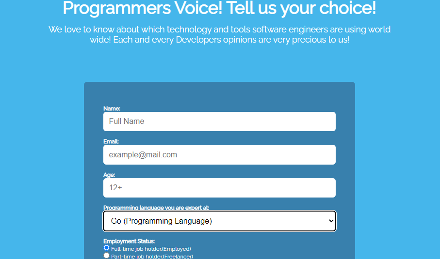
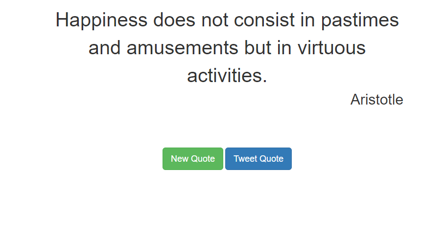

I am a Web Developer currently located in Statesboro,Georgia. This is my personal portfolio website that showcases my experience, education, recent projects, technical skill stack, contact information, and a little bit more about me.

You can view my full portfolio at:

## About Me

Before transitioning into web and software development, I worked as a team lead in a warewhouse in Port Wentworth, Georgia. While in the industry I found myself enjoying the technical and computer driven aspects of the office which lead me to follow my true passion for front-end and back-end development.

My management position brung a fresh prospective to techincal and leaderships roles as it showcases my detailed oriented and organizational skills in any job I perform.

## Recent Projects & Achievements

### Web Development Bootcamp (HTML&CSS)
These are the projects that I have completed while attending FreeCodeCamp 6 weeks development bootcamp learning:
HTML fundamentals: syntax, elements, images, links, lists, forms, buttons.
CSS: selectors, classes, ids, attributes, fonts, colors, sizing, positioning.
Accessible and responsive web design: websites for all and on all devices.
CSS layout tools: positioning elements with CSS Flexbox and CSS grid.

## Projects
  
  1. <strong>Tribute  Page<strong>

  [View Demo](https://codepen.io/tev96/pen/rNKMLyv)
  
  
  2. <strong>Build a Survey Form</strong>
  
  
  
  [View Demo](https://codepen.io/tev96/pen/rNKMyGX)
  

  3. [Build a Product Landing Page]()

  4. Random Quote Generator
  
 

  5. [Build a Personal Portfolio Webpage]()

# Javascript Bootcamp

These are the projects that I have completed while attending FreeCodeCamp 6 weeks development bootcamp learning JavaScript:
Programming fundamentals: syntax, variables, operations, loops, functions.
Data structures: arrays, multidimensional arrays, array methods, objects.
Algorithms: searching, sorting, reversing, merging, splicing, hashing.
Object-oriented programming: methods, constructors, prototypes, inheritance.
Functional programming: terminology, constraints, mapping, filtering.

##  Projects

1. [Palindrome Checker]()

2. [Roman Numeral Converter]()

3. [Caesars Cipher]()

4. [Telephone Number Validator]()

5.  <strong>Building a Magazine</strong>

   
   
  
   [View Demo](https://codepen.io/tev96/pen/rNKMyoa)

## Techinical Skill Stack

### Front End

`HTML` `CSS` `JavaScript` `Typescript` `React ` `JQuery` `Bootstrap` 

### Back End

`Node.js`  `MongoDB` `SQLite` `PostgreSQL` `Golang` `Python`

### Office

`Microsoft Office` `Word` `Excel` `PowerPoint` `Adobe`

