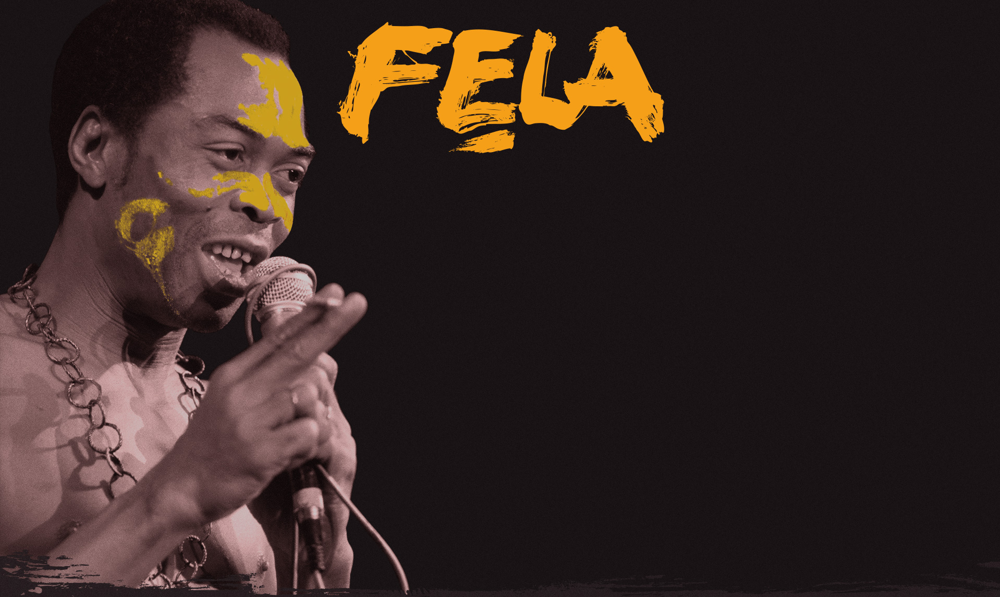

# Web_Development_Portfolio

## Web Development Bootcamp (HTML&CSS)
These are the projects that I have completed while attending FreeCodeCamp 6 weeks development bootcamp learning:
HTML fundamentals: syntax, elements, images, links, lists, forms, buttons.
CSS: selectors, classes, ids, attributes, fonts, colors, sizing, positioning.
Accessible and responsive web design: websites for all and on all devices.
CSS layout tools: positioning elements with CSS Flexbox and CSS grid.

## Projects
  
  1. [Build a Tribute Page]()

  2. [Build a Survey Form]()

  3. [Build a Product Landing Page]()

  4. [Build a Technical Documentation Page]()

  5. [Build a Personal Portfolio Webpage]()

# Javascript Bootcamp

These are the projects that I have completed while attending FreeCodeCamp 6 weeks development bootcamp learning JavaScript:
Programming fundamentals: syntax, variables, operations, loops, functions.
Data structures: arrays, multidimensional arrays, array methods, objects.
Algorithms: searching, sorting, reversing, merging, splicing, hashing.
Object-oriented programming: methods, constructors, prototypes, inheritance.
Functional programming: terminology, constraints, mapping, filtering.

##  Projects

1. [Palindrome Checker]()

2. [Roman Numeral Converter]()

3. [Caesars Cipher]()

4. [Telephone Number Validator]()

5. [Cash Register]()
